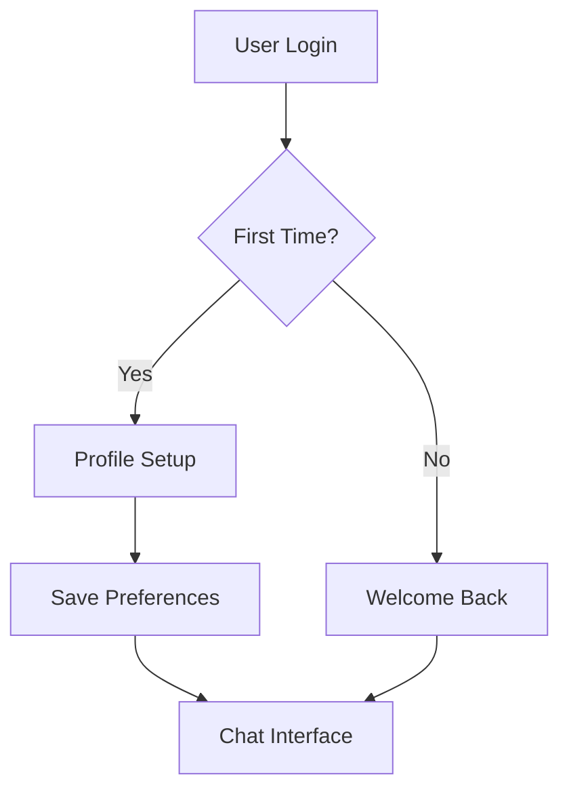
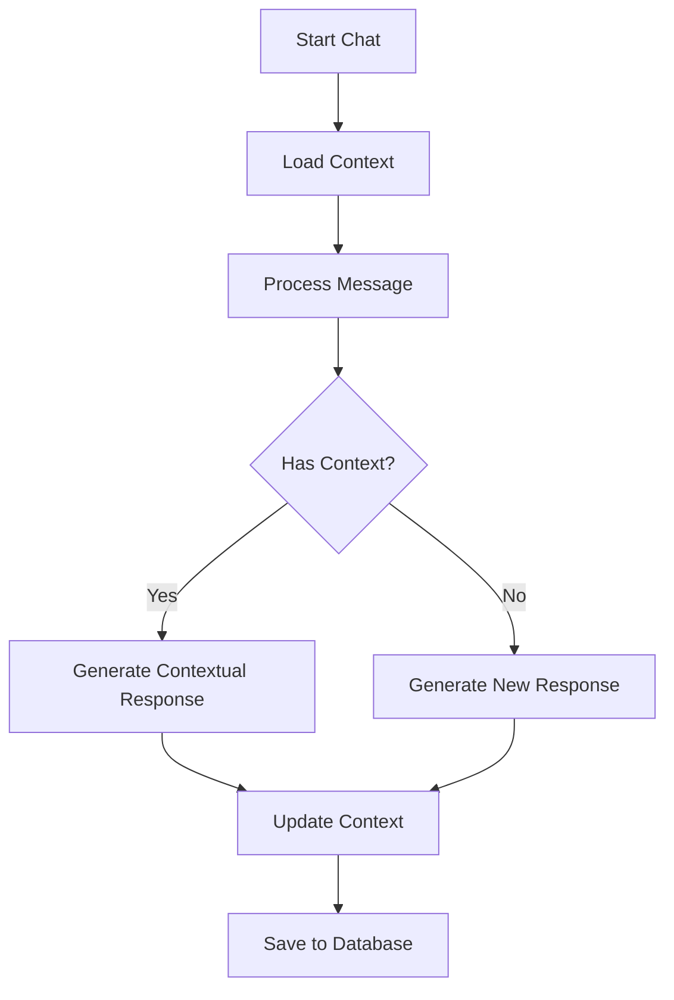

# MiAi Application Flow

## Authentication Flow

### New User Path
1. Initial Landing
   - Display login options (OAuth providers)
   - Clean, minimal interface
   - Welcome message explaining MiAi

2. First-Time Setup
   - Personal Information Form
     ```typescript
     interface UserProfile {
       name: string
       preferences: {
         language: string
         timezone: string
         topics: string[]
       }
     }
     ```
   
   - AI Personality Customization
     ```typescript
     interface AIPersonality {
       baseTraits: {
         friendliness: number // 1-10
         formality: number // 1-10
         verbosity: number // 1-10
       }
       specializations: string[] // e.g., ["technical", "creative", "academic"]
       communicationStyle: string // e.g., "casual", "professional", "academic"
     }
     ```

3. Welcome Screen
   - Personalized greeting
   - "Start New Chat" button
   - Brief tutorial overlay (optional)

### Returning User Path
1. Welcome Back Screen
   - Personalized greeting with last visit date
   - Quick status update
     - New features
     - Conversation summary since last visit
   
2. Action Options
   - "View History" button
   - "Start New Chat" button
   - Quick settings access

## Main Navigation Flows

### Conversation History
1. History View
   - List of previous conversations
     ```typescript
     interface ConversationPreview {
       id: string
       title: string
       lastMessage: string
       date: Date
       summary: string
       tags: string[]
     }
     ```
   
   - Sorting options
     - Date (newest/oldest)
     - Topic
     - Length
   
   - Search functionality
     - Full-text search
     - Tag-based filtering

2. Conversation Details
   - Full conversation thread
   - Context sidebar
   - Export options

### New Chat Flow
1. Chat Initialization
   - Optional topic/context setting
   - Previous context suggestion
   - Mode selection (casual/focused)

2. Chat Interface
   - Message thread
   - Context awareness indicator
   - Push-to-talk button
     ```typescript
     interface ChatControls {
       isPushToTalkActive: boolean
       isProcessing: boolean
       currentContext: string
       messageStatus: 'sending' | 'sent' | 'error'
     }
     ```

## Data Flow

### User Session


### Conversation Flow


## Error Handling

### Common Scenarios
1. Authentication Failures
   - Graceful redirect to login
   - Session recovery attempts
   - Error messaging

2. Connection Issues
   - Offline mode activation
   - Message queue management
   - Retry mechanisms

3. Context Errors
   - Fallback to base personality
   - Context reconstruction
   - User notification

## Performance Considerations

### Loading States
1. Initial Load
   - Progressive content loading
   - Skeleton screens
   - Priority content first

2. Interaction States
   - Immediate feedback
   - Optimistic updates
   - Background processing

### Optimization Points
1. Context Loading
   - Preload common contexts
   - Cache frequent interactions
   - Progressive context enhancement

2. Response Generation
   - Stream responses
   - Background processing
   - Parallel context loading 